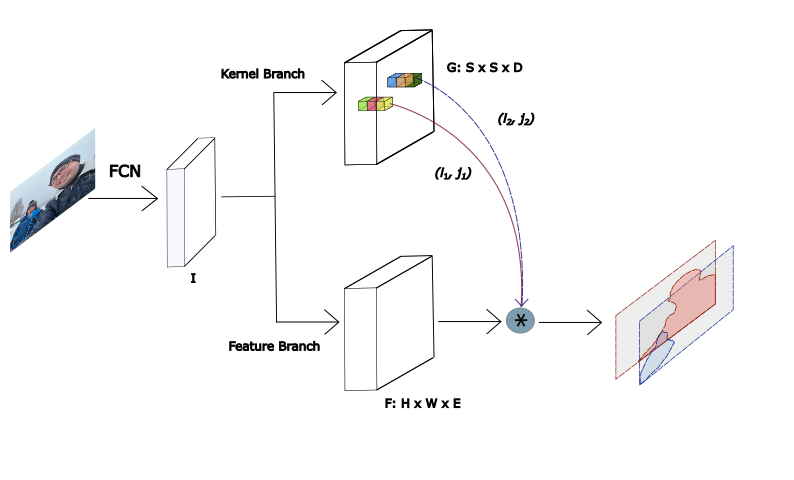

# Dynamic SOLO (SOLOv2) with TensorFlow

This project is an implementation of <strong>Dynamic SOLO (SOLOv2)</strong> using the TensorFlow framework. The goal is to provide a clear explanation of how Dynamic SOLO works and demonstrate how the model can be implemented with TensorFlow.  

## About SOLO

SOLO (Segmenting Objects by Locations) is a model designed for computer vision tasks, specifically instance segmentation.
> [**SOLO: A Simple Framework for Instance Segmentation**](https://arxiv.org/abs/2106.15947),  
> Xinlong Wang, Rufeng Zhang, Chunhua Shen, Tao Kong, Lei Li  
> *arXiv preprint ([arXiv:2106.15947](https://arxiv.org/abs/2106.15947))*  

To understand instance segmentation better, consider the example below, where multiple objects—whether of the same or different classes—are identified as separate instances, each with its own segmentation mask (and the probability of belonging to a certain class):   

  

This project implements the <strong>Dynamic SOLO (SOLOv2)</strong> variant:  



## Who This Project is For

This is <strong>not a production-ready</strong> project. It is primarily intended for educational purposes—especially for individuals without high-performance GPUs who are interested in learning about computer vision and the SOLO model. We chose TensorFlow to make the implementation accessible. The code is thoroughly documented to ensure clarity and ease of understanding.

## Installation, Dependencies, and Requirements

- Python 3.11 is required.
- All dependencies are listed in `requirements.txt`.
- Use `setup.sh` to install all dependencies on Linux.

The project has been tested on <strong>Ubuntu 24.04.2 LTS</strong> with <strong>TensorFlow 2.15.0.post1</strong>. It may work on other operating systems and TensorFlow versions (older than 2.15.0.post1), but we cannot guarantee compatibility.

> <strong>Note:</strong> A GPU with CUDA support is highly recommended to speed up training. The project currently does not support multi-GPU training.

## Datasets

The code supports datasets in the COCO format. We recommend creating your own dataset to better understand the full training cycle, including data preparation. [LabelMe](https://github.com/wkentaro/labelme) is a good tool for this. You don’t need a large dataset or many classes to begin training and see results. This makes it easier to experiment and learn without requiring powerful hardware.  
Alternatively, you can use the original [COCO dataset](https://cocodataset.org/#home), which contains 80 object categories.

## Configuration

All configuration parameters are defined in `config.py` file within the `DynamicSOLOConfig` class.

Set the path to your COCO dataset:  

```
self.coco_root_path = '/path/to/your/coco/dataset'
```

Set the path to the dataset's annotation file:  

```
self.train_annotation_path = f'{self.coco_root_path}/annotations/instances_train2017.json'
```

You have to generate a file containing a list of classes. For example `coco_classes.txt`. It is located next to the project as an example. Set the path to the classes file:  

```
self.classes_path = 'data/coco_classes.txt'
```

Set the path to the training images:  

```
self.images_path = f'{self.coco_root_path}/train2017/'
```

And you can find other intuitive parameters:

```
# Image parameters
self.img_height = 320
self.img_width = 320

# If load_previous_model = True: load the previous model weights (example: './weights/coco_epoch00001000.keras')
self.load_previous_model = False
self.lr = 0.0001
self.batch_size = 8
# If load_previous_model = True, you need to specify self.model_path to indicate which model to read the weights from to continue training.
self.model_path = './weights/coco_epoch00000001.keras'

# Save the model weights every save_iter epochs:
self.save_iter = 1
```

## Training

To start training, run:

```
python train.py
```

Model weights are saved in the `weights` directory every `cfg.save_iter` epochs.

To proceed training:

1) Set configuration parameter `load_previous_model` to `True`:

```
self.load_previous_model = True
```

2) Set the path to the previously saved model:

```
self.model_path = './weights/coco_epoch00000001.keras'
```

## Testing

To test the model:

1) Move your test images in the `/images/test` directory.

2) In the config file, set the path to the model you want to test:

```
self.test_model_path = './weights/coco_epoch00000001.keras'
```

3) Run the test script:

```
python test.py
```

Output images with masks, class labels, and probabilities will be saved in the `/images/res` directory.

## Dataset Evaluation

It is possible to evaluate the data fed to the model before training to ensure that the masks, classes, and scales are applied correctly:

```
python test_dataset.py
```

This script generates one image per instance (i.e., per object and its mask) categorized and scaled. The outputs are saved in `images/dataset_test`.

By default, it processes the first 20 images. To change or remove this limit, edit `test_dataset.py`:

```
number_images=20
```


## Thank you!

We appreciate your interest and contributions toward improving this project. Happy learning!


